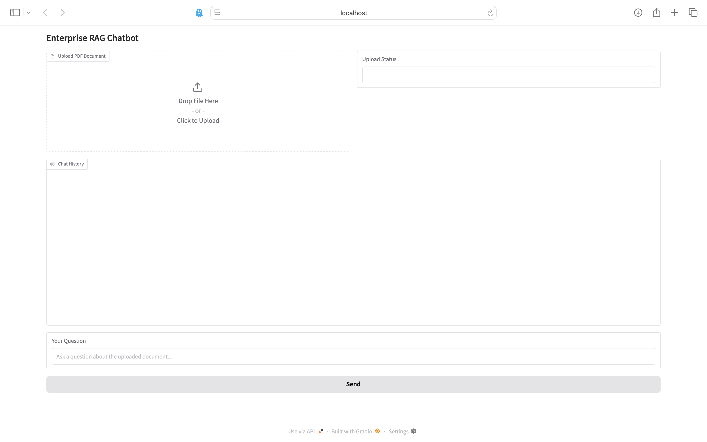

# Enterprise RAG Chatbot

A local document-based chatbot that uses Retrieval-Augmented Generation (RAG) to answer questions from PDF files. Powered by Ollama, ChromaDB, and Gradio, this project demonstrates how to combine vector search with a local LLM to enable private, context-aware question answering.

---

## Features

- Upload any PDF document
- Automatic text extraction and chunking
- Embedding and vector storage with ChromaDB
- Contextual retrieval based on user questions
- Local LLM-powered answer generation using Ollama
- Clean Gradio interface
- Fully containerized with Docker
---

## Demo

### Initial  RAG Chatbot with all features


### Response based on Question and PDF

---


## Tech Stack

| Component             | Purpose                                        |
|----------------------|------------------------------------------------|
| Python               | Core programming language                      |
| Gradio               | Web-based UI for interaction                   |
| PyMuPDF (`fitz`)      | PDF parsing and text extraction                |
| Sentence-Transformers | Embedding model for chunk/query vectors        |
| ChromaDB             | Vector store for semantic retrieval            |
| Ollama (Python SDK)  | Local LLM runtime and API for generation       |
| Docker               | Containerization for consistent deployment     |
---

## Project Structure
| Path                           | Description                                                                     |
| ------------------------------ | ------------------------------------------------------------------------------- |
| `app/`                         | Main application folder containing all Python source files                      |
| `app/main.py`                  | Entrypoint to launch the Gradio web application                                 |
| `app/ui_gradio.py`             | Defines the Gradio Blocks UI and user interaction logic                         |
| `app/ollama_integration.py`    | Constructs prompts and communicates with the Ollama LLM via Python SDK          |
| `app/rag_pipeline.py`          | Handles text extraction from PDFs using PyMuPDF and creates text chunks         |
| `app/vector_store.py`          | Converts chunks to embeddings and handles vector search via ChromaDB            |
| `app/docs/`                    | Mounted folder inside Docker for uploaded PDFs                                  |
| `app/docs/Leave-Policy.pdf`    | Sample PDF document used for demo and testing                                   |
| `images/`                      | Folder containing screenshots and architecture diagram for the README           |
| `images/Before_uploading.png`  | Screenshot showing the UI before uploading a PDF                                |
| `images/Chat_bot_Response.png` | Screenshot showing an LLM-generated response after querying a PDF               |
| `images/workflow.png`          | Visual diagram showing how RAG and components are connected                     |
| `Dockerfile`                   | Defines the environment and steps to build and run the app in Docker            |
| `README.md`                    | Project documentation including setup, architecture, and usage instructions     |
| `requirements.txt`             | List of required Python libraries such as `gradio`, `chromadb`, `PyMuPDF`, etc. |


---
## Workflow Diagram


---

## Getting Started

### 1. Install Ollama (once)
Download from [https://ollama.com/download](https://ollama.com/download) and run a model:
```bash
ollama run llama3
```

### 2. Clone and run
```bash
git clone https://github.com/yourusername/enterprise-rag-chatbot.git
cd enterprise-rag-chatbot
```

### 3. Build the Docker container
```bash
docker build -t enterprise-rag-chatbot .
```

###  Run the app
```bash
docker run -p 7860:7860 \
  -v $(pwd)/docs:/app/docs \
  -e OLLAMA_HOST=http://host.docker.internal:11434 \
  enterprise-rag-chatbot
  ```


 ## Wokrflow Diagram
 [User] → [Gradio UI] → [PDF Parser] → [Text Chunking] → [ChromaDB Vector Store]
                                              ↓
                                  [Query Retrieval]
                                              ↓
                                  [Ollama LLM (via prompt)]
                                              ↓
                                      [Answer to User]


What is Retrieval-Augmented Generation (RAG)?
---------------------------------------------

RAG is a hybrid technique combining:

*   **Retrieval**: fetching relevant context (text chunks from your document)
    
*   **Generation**: passing that context to a language model to generate an informed answer
    

This enables grounded, document-specific Q&A with better factual reliability.

Example Use Cases
-----------------

*   Internal policy chatbots for HR or compliance
    
*   Private medical/legal document assistants
    
*   Secure offline LLM tools for enterprise
    

    

Future Improvements
-------------------

*   Token-by-token streaming of answers
    
*   Support for multiple documents
    
*   Answer traceability (highlighting source chunks)
    
*   Chat export and analytics dashboard
    

Author
------

Eby Thomas 